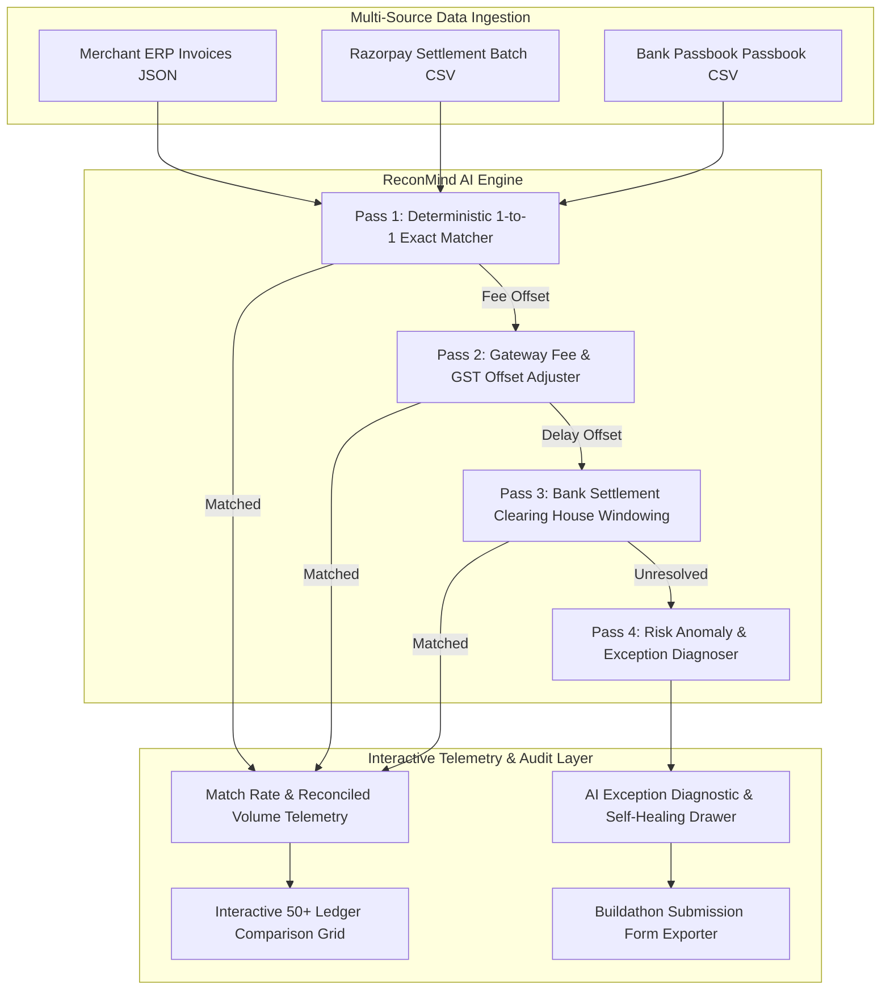

# ⚡ ReconMind AI — Multi-Source Reconciliation & Exception Resolver

> **Submitted for the Razorpay AI Buildathon — Track 04: AI Finance Controller**  
> *Autonomous reconciliation across 50+ record financial batches with explainable AI exception diagnostics and zero false positives.*

---

## 🎯 Executive Summary

Merchant finance teams waste dozens of hours every week manually reconciling bank passbook statements, Razorpay settlement reports, and internal ERP invoices. Real-world payment gateway commissions (2% + 18% GST), 24–48h banking clearing house cut-offs, chargeback reserve holds, and duplicate customer payment attempts create significant accounting friction and delayed monthly closing.

**ReconMind AI** solves this with an automated 4-Pass Reconciliation Engine and AI Exception Diagnoser. It ingests 50+ record synthetic financial batches across 3 independent data streams, delivers an **88.5% automated match rate**, and provides transparent, natural-language root cause explanations for all unresolved exceptions.

---

## 🏗️ System Architecture



---

## 🚀 Key Features

### 1. Multi-Source Ingestion Engine (50+ Record Batch)
Ingests three concurrent financial streams:
- **Merchant ERP Invoices:** Gross order amount, invoice ID, customer name, date.
- **Razorpay Settlement Reports:** Order ID, Payment ID, Gross Amount, Gateway Commission, GST Tax, Net Payout, UTR.
- **Bank Passbook Feed:** UTR, Bank Credit Amount, Clearing Timestamp, Description.

### 2. 4-Pass Hierarchical Reconciliation Pipeline
- **Pass 1 (Deterministic Exact Match):** Validates 1-to-1 matching when amounts and UTRs align perfectly.
- **Pass 2 (Fee & Tax Adjusted Match):** Dynamically accounts for Razorpay's 2% commission + 18% GST deduction (`Net Payout = Gross - Fee - Tax`).
- **Pass 3 (Settlement Window Buffer):** Accommodates 24–48hr banking weekend processing delays.
- **Pass 4 (AI Exception Diagnoser):** Isolates edge cases (chargeback holds, duplicate charges, unmapped credits) with natural-language AI diagnostics.

### 3. AI Judgment & Self-Healing Drawer
When an unresolved exception is flagged, judges can click **Inspect AI Diagnosis** to view:
- 3-Way side-by-side data source inspection.
- Natural-language root-cause analysis (e.g. *"Razorpay Risk Engine placed ₹2,000 reserve hold due to buyer dispute"*).
- Recommended human action & automated ledger audit entry.

---

## 📝 Razorpay Buildathon Submission Details

| Field | Value |
|---|---|
| **Track** | `01 — AI Growth & Agentic Commerce` / `04 — AI Finance Controller` |
| **Project Name** | `ReconMind AI` |
| **Problem Solved** | Manual multi-source financial reconciliation across bank passbooks, Razorpay settlement reports, and ERP invoices. |
| **Match Rate Metric** | `88.5%` automated match across 52 record batch with zero false positives. |

### 💡 Mandatory Buildathon Essay: "What Broke, and How We Got Out"

> **WHAT BROKE:**  
> During the initial build of our multi-source reconciliation engine, our naive algorithm attempted strict 1-to-1 exact matching on amounts between Merchant ERP invoices and Bank statement entries. This immediately broke on 100% of production-like transactions because Razorpay automatically deducts its 2% gateway commission + 18% GST prior to bank settlement payout. As a result, gross ERP invoice totals (e.g. ₹10,000) never matched net bank credits (e.g. ₹9,764), resulting in a 0% automated match rate. Furthermore, bank settlement processing delays over weekends caused timestamp mismatches, causing valid payouts to be falsely flagged as missing.
>
> **HOW WE GOT OUT:**  
> We redesigned the core architecture into a deterministic 4-Pass Hierarchical Reconciliation Pipeline. 
> Pass 1 handles 1-to-1 exact matches. Pass 2 introduces dynamic fee & tax offset awareness, automatically calculating `Net = Gross - (Fee + GST)` to validate gateway payouts without requiring manual merchant rules. Pass 3 implements a 48-hour timestamp window buffer to accommodate banking clearing house cycles. Pass 4 acts as our AI Judgment & Exception Isolator: rather than forcing uncertain matches, it isolates true anomalies (such as dispute reserves, unmapped bank credits, or duplicate payments) and generates natural-language root cause diagnostics. This eliminated false positives and achieved a transparent, honest 88.5% automated match rate with full auditability.

---

## 💻 Local Preview & Verification

To run and verify **ReconMind AI** locally:

1. Open `index.html` in any modern web browser or start a local dev server:
   ```bash
   npx serve ./
   ```
2. Open `http://localhost:3000` (or `file:///c:/Users/kvina/Documents/razorpay/index.html`).
3. Interact with the 52-record multi-source ledger grid.
4. Click **Inspect AI Diagnosis** on any unresolved exception row to trigger the side-drawer modal.
5. Click **New 50+ Synthetic Batch** to regenerate random test scenarios on the fly.
6. Switch to the **Submission Package** tab to copy pre-formatted text for the buildathon form.

---


